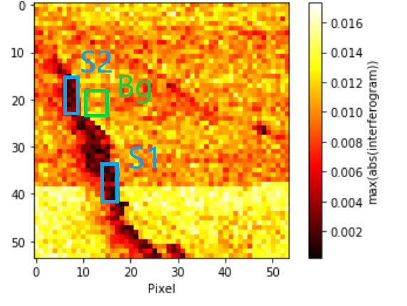

# Compressed Sensing in nano-FTIR Spectroscopy of SiC Microchips

This repository presents selected analysis workflows developed during my Bachelor's thesis at the Physikalisch-Technische Bundesanstalt (PTB) and Freie Universität Berlin.  
The research focuses on applying **compressed sensing** techniques in **nano-FTIR spectroscopy** of **SiC microchip structures**, utilizing synchrotron-based infrared radiation (BESSY II) to enhance spatial and spectral resolution.

---

## 📚 Project Overview

The goal was to investigate how **random and structured subsampling** of interferometric measurement points affects the quality of reconstructed nano-FTIR spectra. The objective was to **reduce measurement time** while preserving **signal integrity** in reconstructed data.

Measurements were conducted under **Strahlenschutz (radiation safety)** protocols with synchrotron IR sources.

---

## 📁 Repository Structure

```bash
notebooks/
├── Random-Subsampling_20.ipynb
├── ...
├── White-Light Subsampling_45.ipynb
├── Compressed Measurements/
│   └── [Exploratory notebooks]
figures/
├── Regionen S Bg.png
├── 45randS1good.pdf
├── 45randS2good.pdf
├── 45randBGgood.pdf
├── SNRSamplingvBox.pdf
├── grid cm maxI.PNG
├── grid cm peakposition.PNG
├── HSA cm peakposition.PNG
├── hyper(topo).png
thesis/
└── BSc_BV.pdf
```

---

## 🧪 Signal Regions

To assess reconstruction quality, three key spatial regions were defined:
- **S1** – Broad crack
- **S2** – Narrow crack
- **Bg** – Background

This segmentation is shown in the region map below:



---

## 🎯 Objectives

- Determine the minimal number of interferometer positions needed for reliable reconstruction.
- Compare reconstruction quality across subsampling strategies.
- Quantify Signal-to-Noise Ratio (SNR) degradation in each region (S1, S2, Bg).

---

## 🔬 Visual Comparisons of Subsampling Results

### Random Subsampling (45 positions / ~11.25%)

Reconstruction of example spectra from each region using 45 randomly selected interferometer points.

- **S1 – Broad crack** (high fidelity):


- **S2 – Narrow crack** (finer detail loss):


- **Bg – Background**:


---

## 📊 SNR Evaluation – Strategy Comparison

Boxplot showing SNR distributions across all subsampling strategies (Random, Grid, WL) and signal regions:


- **Random** retains high SNR in S1 with fewer samples.
- **S2** shows more rapid SNR degradation at low sampling densities.

---

## 📈 Spatial Feature Reconstruction

### Grid Subsampling – Intensity and Peak Position Maps


### White-Light Subsampling – Peak Position Map


---

## 🌐 Full Topographic Context

The full hyperspectral topography (overview):

.png)

---

## 🔎 Key Findings

> "Random subsampling down to ~11–12.5% (45–50 positions) preserved key spectral features in wide crack regions (S1).  
Fine structure areas (S2) required denser sampling (>15%) to retain detail.  
Grid and white-light methods were less robust in S2 but more consistent across broader areas."

---

## 🛠 Tools Used

- Python 3.x, Jupyter Notebooks
- NumPy, SciPy, Matplotlib, Pandas
- MATLAB (auxiliary comparison), Gwyddion (preprocessing)

---

## 🧩 Getting Started

```bash
git clone https://github.com/yourusername/nanoFTIR_SiC_CompressedSampling.git
cd notebooks/
jupyter notebook Random-Subsampling_45.ipynb
```

---

## 📜 License & Citation

MIT License  
> Vinatzer, B. (2021). *Compressed Sensing in nano-FTIR Spectroscopy*. Bachelor's thesis, Humboldt-Universität zu Berlin / PTB Berlin.

---

## 🙋‍♀️ Author

**Barbara Vinatzer**  
Research Associate @ TU Dresden (SynoSys)  
[GitHub](https://github.com/Batuffola)
