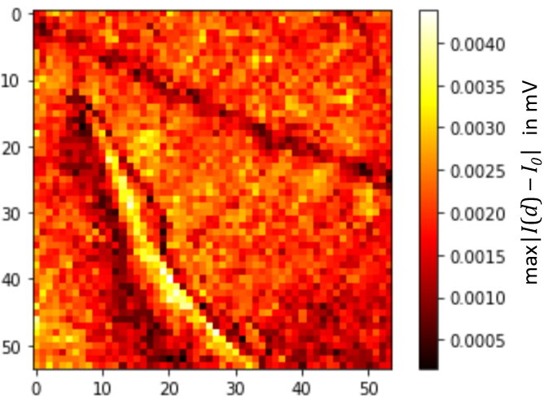

# Compressed Sensing in nano-FTIR Spectroscopy of SiC Microchips

This repository presents selected analysis workflows developed during my Bachelor's thesis under the supervision of **Prof. Bernd Kästner** and **Prof. Eckart Rühl**, at the Physikalisch-Technische Bundesanstalt (PTB) and Freie Universität Berlin.    
The research focuses on applying **compressed sensing** techniques in **nano-FTIR spectroscopy** of **SiC microchip structures**, utilizing synchrotron-based infrared radiation (BESSY II) to enhance spatial and spectral resolution.

---

## 📚 Project Overview

The goal was to investigate how **random and structured subsampling** of interferometric measurement points affects the quality of reconstructed nano-FTIR spectra. The objective was to **reduce measurement time** while preserving **signal integrity** in reconstructed data.

Measurements were conducted under **Strahlenschutz (radiation safety)** protocols with synchrotron IR sources.

---

## 🧪 Experimental Data Context

This project is based on real interferometric measurements conducted during a Bachelor’s thesis project at PTB Berlin using **infrared synchrotron radiation from BESSY II**.

- Measurements were performed on **SiC microchip samples** using a nano-FTIR setup operated in a **radiation-controlled environment**.
- The interferograms were collected across hundreds of interferometer positions per pixel (typically **400 points** per scan).
- Spectral data was reconstructed using **Fourier analysis**, and further evaluated with custom Python workflows for **compressed sensing**.

For full experimental context, see [`thesis/BSc_BV.pdf`](thesis/BSc_BV.pdf).

---

## 📁 Repository Structure

```bash
notebooks/
├── Random-Subsampling_20.ipynb
├── ...
├── White-Light Subsampling_45.ipynb
├── Compressed Measurements/
│   └── [Exploratory notebooks]
figures/
├── [All plots & image figures]
thesis/
└── BSc_BV.pdf
```

---

## 🧪 Signal Regions

To assess reconstruction quality, three key spatial regions were defined:
- **S1** – Broad crack
- **S2** – Narrow crack
- **Bg** – Background

This segmentation is shown in the region map below:


---

## 🎯 Objectives

- Determine the minimal number of interferometer positions needed for reliable reconstruction.
- Compare reconstruction quality across subsampling strategies.
- Quantify Signal-to-Noise Ratio (SNR) degradation in each region (S1, S2, Bg).

---

## 🔬 Visual Comparisons of Subsampling Results

### Random Subsampling (45 positions / ~11.25%)

Reconstruction of example spectra from each region using 45 randomly selected interferometer points.

- **S1 – Broad crack** (high fidelity):  
  

- **S2 – Narrow crack** (finer detail loss):  
  

- **Bg – Background**:  
  

---

## 📊 SNR Evaluation – Strategy Comparison

Boxplot showing SNR distributions across all subsampling strategies (Random, Grid, WL) and signal regions:


- **Random** retains high SNR in S1 with fewer samples.
- **S2** shows more rapid SNR degradation at low sampling densities.

---

## 🔬 Simulated Subsampling – Best vs Worst Reconstructions

The following images show simulation-based comparisons of **reconstructed vs original interferograms and spectra** for different signal regions (S1, S2, Bg).  
Each figure shows the **best reconstruction (left)** and **worst reconstruction (right)** for the given **sampling strategy**.

---

### 🔁 Random Subsampling – Signal Regions

  
  


---

### 🧩 Grid Subsampling – Signal Regions

  
  


---

### 💡 White-Light Sampling – Signal Regions

  
  


---## 📷 Real Compressed Measurements (nano-FTIR)

In addition to synthetic simulations, this repository also includes real-world compressed measurements on a SiC microchip using a nano-FTIR setup at PTB Berlin. These measurements were acquired with **hardware-level subsampling** using synchrotron IR radiation (BESSY II) and provide a critical benchmark for testing the effectiveness of Grid and White-Light (WL) sampling strategies.

### 🔁 Grid-Sampling Measurement

A compressed grid-sampling scan was performed across a SiC indent area and lasted **2h 35min**, reducing the measurement time by more than 50%. However, due to a **6-hour delay between region selection and scanning**, spatial drift occurred — evident from a **checkerboard pattern** in the reconstructed maps.

**Comparison of Grid vs. Full Measurement:**

<table>
<tr>
<td><b>Grid Sampling</b><br></td>
<td><b>Full Measurement</b><br></td>
</tr>
<tr>
<td><b>Grid Peak Map</b><br></td>
<td><b>Full Peak Map</b><br></td>
</tr>
</table>

Despite spatial mismatch, the spectral reconstructions below still clearly retain the SiC resonance features:


---

### 💡 White-Light Sampling Measurement

A WL-Random compressed measurement was aligned **without drift**, matching the full region used earlier. It used empirically derived **"magic number" interferometer positions** and achieved results with **only 25%** of the full measurement time (~1h 25min).

**White-Light Maxima and Peak Position Maps:**

<table>
<tr>
<td><b>WL Max Amplitude</b><br></td>
<td><b>Full Measurement</b><br></td>
</tr>
<tr>
<td><b>WL Peak Positions</b><br></td>
<td><b>Full Peak Map</b><br></td>
</tr>
</table>

WL-sampled spectra emphasized **major peaks** and smoothed the background but failed to recover finer resonances:


---

### 🧠 Summary from Thesis

- Grid Sampling showed good spectral reconstruction **despite spatial drift**, proving robustness of spectral content.
- WL Sampling preserved **broader spatial structures** and suppressed noise, but was sensitive to peak shifts and did not resolve finer cracks.
- Measurement strategies represent a **trade-off between speed, spatial fidelity, and reconstruction quality**.
- Thermal drift between scan initiation and execution can significantly affect positional accuracy — emphasizing the importance of **synchronized acquisition**.

See: **Chapter 5.2 in [`BSc_BV.pdf`](thesis/BSc_BV.pdf)** for deeper insight and figures.

---


---

## 🔎 Key Findings

> "Random subsampling down to ~11–12.5% (45–50 positions) preserved key spectral features in wide crack regions (S1).  
Fine structure areas (S2) required denser sampling (>15%) to retain detail.  
Grid and white-light methods were less robust in S2 but more consistent across broader areas."

---

## 🛠 Tools Used

- Python 3.x, Jupyter Notebooks
- NumPy, SciPy, Matplotlib, Pandas
- MATLAB (auxiliary comparison), Gwyddion (preprocessing)

---

## 🧩 Getting Started

```bash
git clone https://github.com/yourusername/nanoFTIR_SiC_CompressedSampling.git
cd notebooks/
jupyter notebook Random-Subsampling_45.ipynb
```

---

## 📜 License & Citation

MIT License  
> Vinatzer, B. (2021). *Compressed Sensing in nano-FTIR Spectroscopy*. Bachelor's thesis, Humboldt-Universität zu Berlin / PTB Berlin.

---

## 🙋‍♀️ Author

**Barbara Vinatzer**   
[GitHub](https://github.com/Batuffola)
