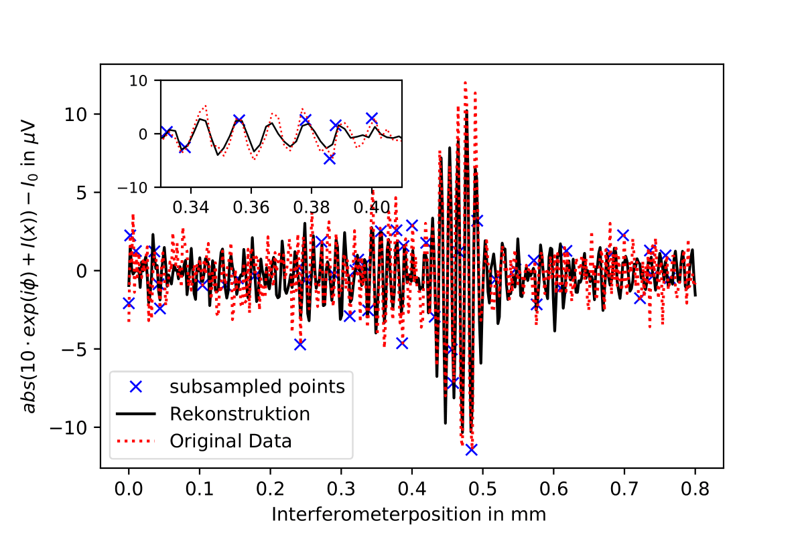

# Compressed Sensing in nano-FTIR Spectroscopy of SiC Microchips

This repository presents selected analysis workflows developed during my Bachelor's thesis under the supervision of **Prof. Bernd Kästner** and **Prof. Eckart Rühl**, at the Physikalisch-Technische Bundesanstalt (PTB) and Freie Universität Berlin.    
The research focuses on applying **compressed sensing** techniques in **nano-FTIR spectroscopy** of **SiC microchip structures**, utilizing synchrotron-based infrared radiation (BESSY II) to enhance spatial and spectral resolution.

---

## 📚 Project Overview

The goal was to investigate how **random and structured subsampling** of interferometric measurement points affects the quality of reconstructed nano-FTIR spectra. The objective was to **reduce measurement time** while preserving **signal integrity** in reconstructed data.

Measurements were conducted under **Strahlenschutz (radiation safety)** protocols with synchrotron IR sources.

---

## 🧪 Experimental Data Context

This project is based on real interferometric measurements conducted during a Bachelor’s thesis project at PTB Berlin using **infrared synchrotron radiation from BESSY II**.

- Measurements were performed on **SiC microchip samples** using a nano-FTIR setup operated in a **radiation-controlled environment**.
- The interferograms were collected across hundreds of interferometer positions per pixel (typically **400 points** per scan).
- Spectral data was reconstructed using **Fourier analysis**, and further evaluated with custom Python workflows for **compressed sensing**.

For full experimental context, see [`thesis/BSc_BV.pdf`](thesis/BSc_BV.pdf).

---

## 📁 Repository Structure

```bash
notebooks/
├── Random-Subsampling_20.ipynb
├── ...
├── White-Light Subsampling_45.ipynb
├── Compressed Measurements/
│   └── [Exploratory notebooks]
figures/
├── [All plots & image figures]
thesis/
└── BSc_BV.pdf
```

---

## 🧪 Signal Regions

To assess reconstruction quality, three key spatial regions were defined:
- **S1** – Broad crack
- **S2** – Narrow crack
- **Bg** – Background

This segmentation is shown in the region map below:


---

## 🎯 Objectives

- Determine the minimal number of interferometer positions needed for reliable reconstruction.
- Compare reconstruction quality across subsampling strategies.
- Quantify Signal-to-Noise Ratio (SNR) degradation in each region (S1, S2, Bg).

---

## 🔬 Visual Comparisons of Subsampling Results

### Random Subsampling (45 positions / ~11.25%)

Reconstruction of example spectra from each region using 45 randomly selected interferometer points.

- **S1 – Broad crack** (high fidelity):  
  

- **S2 – Narrow crack** (finer detail loss):  
  

- **Bg – Background**:  
  

---

## 📊 SNR Evaluation – Strategy Comparison

Boxplot showing SNR distributions across all subsampling strategies (Random, Grid, WL) and signal regions:


- **Random** retains high SNR in S1 with fewer samples.
- **S2** shows more rapid SNR degradation at low sampling densities.

---

## 🔬 Simulated Subsampling – Best vs Worst Reconstructions

The following images show simulation-based comparisons of **reconstructed vs original interferograms and spectra** for different signal regions (S1, S2, Bg).  
Each figure shows the **best reconstruction (left)** and **worst reconstruction (right)** for the given **sampling strategy**.

---

### 🔁 Random Subsampling – Signal Regions

  
  


---

### 🧩 Grid Subsampling – Signal Regions

  
  


---

### 💡 White-Light Sampling – Signal Regions

  
  


---

## 📷 Real Compressed Measurements (nano-FTIR)

In addition to simulations, this project includes real-world compressed measurements conducted on SiC microchip samples using the **nano-FTIR setup at PTB Berlin** with **IR synchrotron radiation** from BESSY II.

### Overview

These measurements were not fully sampled and cropped post hoc — instead, they were **intentionally subsampled** during acquisition using different strategies (e.g., white-light aligned, grid, or equidistant sampling patterns).

- Interferograms were directly acquired at **subsampled interferometer positions**.
- Spectral reconstructions were compared to a fully sampled reference.
- Evaluations were performed on both **peak amplitude** and **peak position** accuracy.

---

### 🌐 Spatial Overview – Peak Maps

**White-Light Subsampling (45 points)**  
  
  


---

### 📈 Grid Subsampling – Real Measurement

**Grid Max Intensity Map (45 points)**  
  


---

### 📌 Interpretation from Thesis

- The Grid-Sampling measurement lasted **2h 35min**, but due to a **24-hour delay**, the scan captured a **region offset from the original indent**.
- Positional **drift over time** (especially between submatrices) led to spatial mismatch and artifacts (e.g. chessboard pattern).
- Despite this, **spectral reconstructions were still meaningful**, preserving the main SiC resonances.
- In contrast, **White-Light sampling was properly realigned** and more spatially accurate.
- Its optimized sampling scheme preserved major peak structures with only 25% of the full acquisition time.

See: **Kapitel 5.1.2 – Komprimierte reale Messdaten**, [`BSc_BV.pdf`](thesis/BSc_BV.pdf)

---

## 🔎 Key Findings

> "Random subsampling down to ~11–12.5% (45–50 positions) preserved key spectral features in wide crack regions (S1).  
Fine structure areas (S2) required denser sampling (>15%) to retain detail.  
Grid and white-light methods were less robust in S2 but more consistent across broader areas."

---

## 🛠 Tools Used

- Python 3.x, Jupyter Notebooks
- NumPy, SciPy, Matplotlib, Pandas
- MATLAB (auxiliary comparison), Gwyddion (preprocessing)

---

## 🧩 Getting Started

```bash
git clone https://github.com/yourusername/nanoFTIR_SiC_CompressedSampling.git
cd notebooks/
jupyter notebook Random-Subsampling_45.ipynb
```

---

## 📜 License & Citation

MIT License  
> Vinatzer, B. (2021). *Compressed Sensing in nano-FTIR Spectroscopy*. Bachelor's thesis, Humboldt-Universität zu Berlin / PTB Berlin.

---

## 🙋‍♀️ Author

**Barbara Vinatzer**   
[GitHub](https://github.com/Batuffola)
